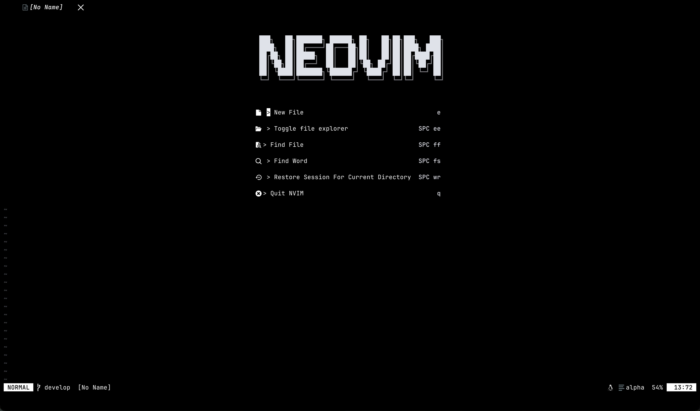
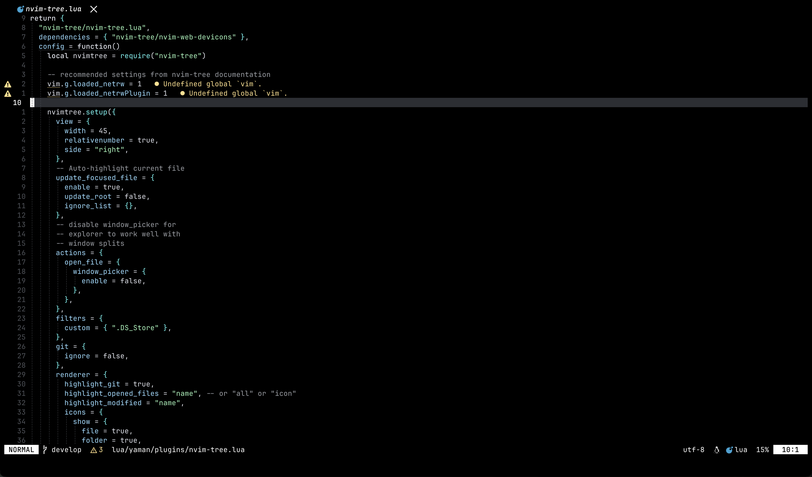
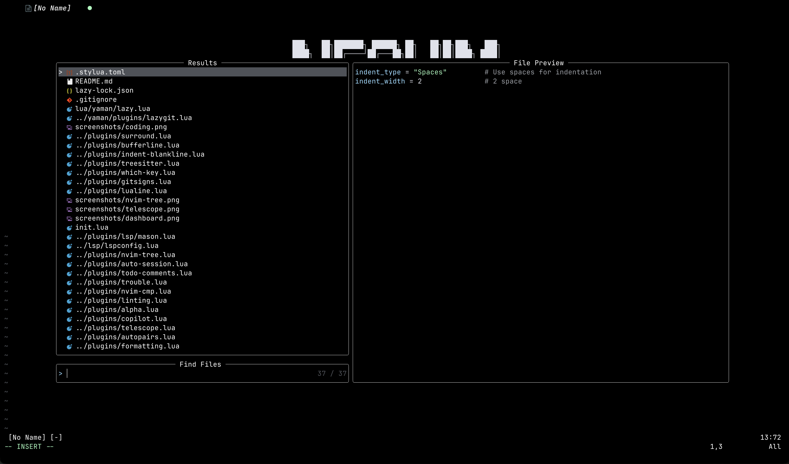
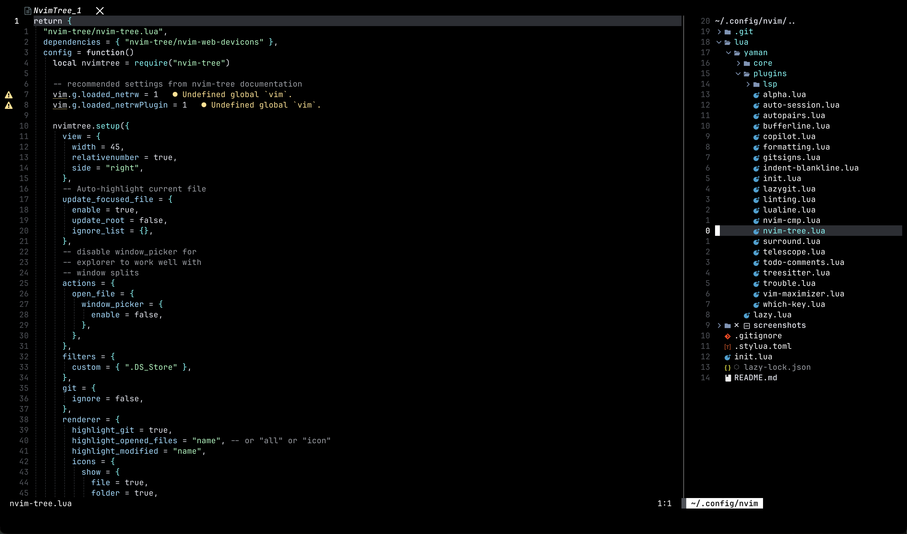

# Neovim Configuration

A modern, feature-rich Neovim configuration built with Lua and lazy.nvim. Designed for efficiency and productivity with a focus on web development, Python, Rust, and general programming.

## Screenshots

**Dashboard**


**Coding Interface**


**Telescope Fuzzy Finder**


**File Explorer**


## Features

### 🎨 **UI & Theme**

- **Lualine** status line with lazy.nvim update indicators
- **Bufferline** for tab management with slanted separators
- **Alpha-nvim** dashboard with custom NEOVIM ASCII art
- **Which-key** for keybinding hints
- **Indent-blankline** for visual indentation guides

### 🔍 **Navigation & Search**

- **Telescope** fuzzy finder for files, grep, and more
- **Nvim-tree** file explorer positioned on the right
- **Todo-comments** highlighting and navigation
- **Trouble** diagnostics and quickfix window

### 💻 **Language Support & LSP**

- **Mason** for automatic LSP server, formatter, and linter installation
- **Nvim-lspconfig** with pre-configured servers:
  - TypeScript/JavaScript (ts_ls, eslint)
  - HTML, CSS, TailwindCSS
  - Python (pyright, ruff)
  - Rust (rust_analyzer)
  - Lua (lua_ls)
  - JSON, YAML, Docker, Markdown
- **Treesitter** for advanced syntax highlighting and text objects
- **Nvim-cmp** intelligent autocompletion with LSP integration

### 🛠️ **Development Tools**

- **Conform.nvim** for code formatting (prettier, stylua, ruff)
- **Nvim-lint** for real-time linting
- **Format on save** enabled by default
- **Gitsigns** for Git integration in the gutter
- **diffview** integration for advanced Git operations
- **Comment.nvim** for smart commenting
- **Nvim-surround** for text object manipulation
- **Autopairs** for automatic bracket pairing
- **Substitute.nvim** for enhanced substitution operations
- **ToggleTerm** for integrated terminal management

### ⚡ **Productivity**

- **Auto-session** for workspace session management
- **Vim-tmux-navigator** for seamless tmux integration
- **Vim-maximizer** for split window maximization
- **LuaSnip** with friendly-snippets for code snippets
- **Dressing.nvim** for enhanced UI elements

## Installation

### Prerequisites

- Neovim >= 0.9.0
- Git
- A Nerd Font (for icons)
- Node.js (for some LSP servers)
- Python (for Python development)
- Rust (for Rust development)

### Required External Tools

The configuration will automatically install most tools via Mason, but some may need manual installation:

```bash
# Essential tools (Mason will install these automatically)
npm install -g prettier eslint_d
pip install ruff
```

### Setup

1. **Backup your existing Neovim configuration**:

```bash
mv ~/.config/nvim ~/.config/nvim.backup
mv ~/.local/share/nvim ~/.local/share/nvim.backup
```

2. **Clone this configuration**:

```bash
git clone <your-repo-url> ~/.config/nvim
```

3. **Start Neovim**:

```bash
nvim
```

4. **Install plugins**: The lazy.nvim plugin manager will automatically install all plugins on first startup.

5. **Install LSP servers, formatters, and linters**: Open any file and run `:Mason` to ensure all tools are installed.

## Configuration Structure

```
~/.config/nvim/
├── init.lua                     # Entry point
├── lua/yaman/
│   ├── core/
│   │   ├── init.lua            # Core initialization
│   │   ├── options.lua         # Neovim options
│   │   └── keymaps.lua         # General keymaps
│   ├── lazy.lua                # Lazy.nvim setup
│   └── plugins/
│       ├── init.lua            # Essential plugins
│       ├── lsp/
│       │   ├── lspconfig.lua   # LSP configuration
│       │   └── mason.lua       # Mason setup
│       ├── [plugin-name].lua   # Individual plugin configs
│       └── ...
└── .stylua.toml                # Stylua formatter config
```

## Customization

### Adding New LSP Servers

Edit `lua/yaman/plugins/lsp/mason.lua` and add your desired server to the `ensure_installed` list:

```lua
ensure_installed = {
  -- existing servers...
  "your_new_server", -- Add here
},
```

### Changing Colorscheme

Edit `lua/yaman/plugins/color-scheme.lua` to use a different theme:

```lua
-- Replace with your preferred colorscheme
return {
  "your-colorscheme/repo",
  config = function()
    vim.cmd.colorscheme("your-theme")
  end,
}
```

### Adding New Plugins

Create a new file in `lua/yaman/plugins/` or add to an existing file:

```lua
return {
  "author/plugin-name",
  config = function()
    -- Plugin configuration
  end,
}
```

## Language-Specific Features

### JavaScript/TypeScript

- ESLint integration for linting
- Prettier for formatting
- TypeScript LSP for intelligent features
- Auto-import and auto-completion

### Python

- Pyright LSP for type checking and IntelliSense
- Ruff for lightning-fast linting and formatting
- Import organization
- Python-specific snippets

### Rust

- rust-analyzer for comprehensive Rust support
- Automatic formatting with rustfmt
- Cargo integration
- Error highlighting and suggestions

### Lua

- Lua LSP with Neovim-specific enhancements
- Stylua formatting
- Neovim API completion

## Troubleshooting

### LSP Not Working

1. Check if the LSP server is installed: `:Mason`
2. Restart LSP: `<leader>rs`
3. Check LSP status: `:LspInfo`

### Plugins Not Loading

1. Update plugins: `:Lazy sync`
2. Check for errors: `:Lazy log`
3. Restart Neovim

### Formatting Not Working

1. Ensure formatter is installed via Mason
2. Check conform configuration in `lua/yaman/plugins/formatting.lua`
3. Manually format: `<leader>mp`

## License

This configuration is open source and available under the [MIT License](LICENSE).
